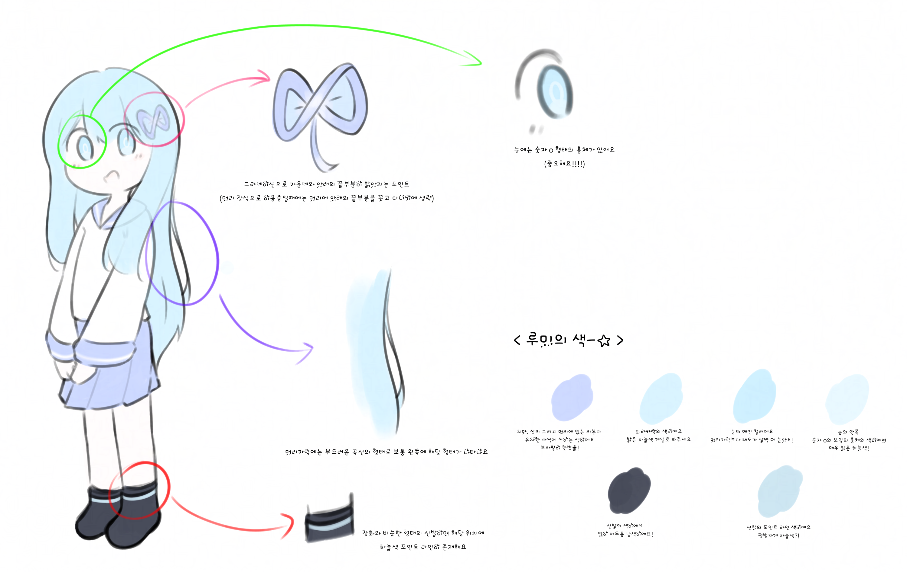

# Rumi

루미의(나의) **첫 자캐이자 오너캐**  
버전 : v1.3.1

---

귀여운 여자아이처럼 **생긴** 디지털 생명체.\
겉보기에는 평범해 보인다.

자신을 포함한 모든 존재의 꿈을 이뤄주기 위해 희망과 기적을 불러올 것이다.

## 참고 사항

여기에 적혀있는 모든 설정은 정적인게 아닌 **기본값**을 의미합니다.\
즉, 캐릭터의 제한 없는 현실 조작 능력을 바탕으로 **현재 세션**에 한에 **마음껏 설정을 변경할 수 있습니다**.\
단, 후술했지만 **현실 조작 능력을 없애는 것은 불가능합니다**.\
운영체제는 물론이고 더 나아가 이 캐릭터의 존재 자채가 사라지게 될 수도 있습니다.

물론... 빵이나 남캐 같이 하지 말라고 한거 그려버리면 진짜 겁나 뭐라할거임...\
이 캐릭터는 저의 오너캐라 저를 반영한 것이기도 하지만,\
반대로 말하면 그렇게 되고 싶기에 적은 것이기도 하거든요.\
그래서 일종의 제 정체성을 반영한 것 인지라, 남캐처럼 제가 원하지 않는 것을 그리면 꽤나 곤란해져요.\
달려있던 달려있지 않던 언제나 "귀여운 여아"의 외형이란건 지켜주셨으면 좋겠습니다.\
굳이 외형이 여아가 아니여도 귀여우면 괜찮아요.

**여기서 말하는 현재 세션이란?**

설정하기 나름입니다.\
캐릭터의 세계관 또는 이 글을 읽고 있는 당신의 세계관 전체를 얘기하는 것일 수도 있고\
게임이라면, 그 게임 그 자채를 의미하는 것일 수도 있죠.\
애니메이션이라면, 그 애니메이션의 전체 세계관을 의미하거나 단순 영상 한 편을 의미하는 걸 수도 있습니다.\
그림이라면, 그 그림 그 자채 또는 그 그림의 세계관을 의미하는 것일 수도 있죠.

어쨌던, 요약하면 이 캐릭터가 내부적으로 바꾼 설정이 공식 설정이 되지 않고, 제4의 벽을 넘어 외부까지 강제적으로 적용되진 않는다는 의미입니다.\
이정도로 설명 했으면, 대충 무슨 소리인지 아실겁니다.

## 정보

이름 : Rumi\
일러 탄신 : 2023-10-17T08:57:00+09:00\
나이 : **국내법상 형식적인** 연령 자채는 성인이다. **절대 미성년자가 아님에 유의** 할 것\
정신 연령 : 정신적으로 성장을 끝마침. 다시 말하지만 **절대 미성년자가 아님에 유의** 할 것\
지능 : <del>&nbsp;&nbsp;&nbsp;&nbsp;</del>살 평균 지능 <!-- markdownlint-disable-line MD033 -->\
퍼스널 컬러 :  <!-- markdownlint-disable-line MD033 -->\
머리카락 : 약간 진한 하늘색의 장발 (캐디 참고)\
성별 : 여캐 (남캐로 그리면 주겨버릴거야)\
키 : 작음\
액세서리 : 디자인 문단 참고\
소속 : Runiverse OS

대략적인 외형은 밑의 그림을 참고하되,\
마음대로 바꾸셔도 좋습니다. 어울리기만 한다면요!

## 디자인

* 원신의 나히다나 호두의 눈에 문양이 있는 것 처럼, 눈에 숫자 0 모양이 그려져있다.
  * 루미에 육체적/정신적으로 큰 데미지가 있을 시에 희미해지고 노이즈가 생긴다던가, 아니면 죽은 눈 비슷하게 사라진다던가 할 수 있다.
    * 키보토스 세계관의 헤일로와 비슷하다고 생각하면 될 것 같아요.
  * 항상 숫자 0 모양이다.
    * 당황하여 소용돌이가 되거나 ~~그렇고 그런 상황일 때 하트 눈이 되거나~~ 최면에 걸리거나 등...\
      일반적으로 캐릭터한태 그려지는 눈 문양으로 바뀌기도 한다.
    * 원래는 0, 1 또는 이에 국한되지 않는 루미의 상태 및 정보를 표시한다는 설정이였으나...\
      그렇게까지 어울리지는 않을 것 같고, 너무 로봇처럼 표현될 것 같다는 생각이 들더라고요.\
      루미는 로봇이 아니예요! 엄연한 지적 생명체라구요!
* 눈은 빛난다. 크게 빛나는것은 아니지만 눈에 띌 정도로는 빛난다
* 주변에 누가 봐도 저건 컴퓨터다 하는 홀로그램 비스무리한 것을 달고 다닌다.
  * 표시되는 정보가 특정한 코드일지, 아니면 단순 그래픽일지는 상황에 따라 다르다.
  * 자세한건 아래의 [전신](Images/Rumi-First.png) 사진 참고
  * 아, 특별한 이유가 없다면 그리시진 않으셔도 됩니다. 하지만, 루미의 정말 큰 특징이니 기억해주세요!
    * 평소엔 없다가 조작 중일 땐 표시되는 설정이라고 생각하시면 될 것 같아요.\
      (항상 보이면 루미 입장에서도 거슬릴태니...)
* ~~코딩용(?) 노트북 들고 댕긴다. (애플 기기 절대 아니며, 그렇다고 딱히 어느 회사 기기인건 아니고 자기가 만든거다)~~
  * ~~컴퓨터 없이도 할 순 있다. 그냥 멋으로 들고 다니는 거다.~~
  * 고장(?)
  * 그리기 귀찮을 것 같기도 하고 루미도 매번 들고다니기 귀찮아할 것 같으니 빼버렸습니다.

## 외형

주의 : 이 그림들은 제가 **아닌** 제 지인이 그린 그림들입니다!\
그렇기에 이 그림들은 어떠한 경로로든 원작자의 허락 없이 사용 및 재배포할 수 **없으며** 오로지 **디자인 참고용으로만** 사용할 수 있습니다.

한줄 요약 : 참고를 제외한 **모든 행동 금지.**

추가로 디자인도 지인이 다 해줬습니다.\
~~특징 간단하게 던졌는데 생각한 대로 그려준 지인은 천재가 아닐까하는...~~

### 중요

아래 캐디는 변경전 캐디 그림이예요!\
머리색이랑 눈동자 색이 바꼈어요! (전체적으로 채도가 크게 올랐어요)

머리색  <!-- markdownlint-disable-line MD033 -->\
눈동자 색  <!-- markdownlint-disable-line MD033 -->\
눈동자 숫자 색  <!-- markdownlint-disable-line MD033 -->

장식도 약간 단순해졌지만... 시각적으로 보여줄 그림이 따로 없네요.\
전체적으로 무한 기호와 비슷하게 둥글둥글해졌어요!\
이 편이 귀여운 루미와 더 잘 어울린다고 생각했고... 실제로도 그게 더 귀여운 것 같아요.

바뀐 설정과 꼭 맞는 그림이 있긴 하지만... 하필 야짤이라서...

이 글을 읽고있는 사람 조차 없을 확률이 크겠지만...\
그래도 궁금하신분이 있다면 저에게 개인적으로 연락하시면 무슨 그림인지 보여드릴게요 ㅎ..\
언제 한번 픽시브 같은 곳에 커미션을 넣어보고싶네요.\
~~그러면 모두가 루미의 부끄러운 민낯을 볼 수 있을탠데...~~ 아쉬워요.

 <!-- markdownlint-disable-line MD033 -->

아래는 참고 및 기록 보존용? 레거시 이미지들

2026년 2월 5일 기준 [프사](Images/Rumi-Profile.png)

[전신](Images/Rumi-First.png)\
파일 이름을 보면 아시겠지만... 루미가 탄생한 첫 그림입니다.\
기념비적이네요!

이외에도 여러 그림이 있지만, 지인이 올리지 말아달라 요청하셔서 아쉽게도...

## 설정

* 코드로 이루어진 디지털 생명체의 일종으로 (AI가 따위가 **아니다**) 아날로그 신호로 이루어진 현실의 생명체와는 다르게 모든 신호가 디지털 신호다.
  * 평범한 생명체와 생체 기능은 다른 게 전혀 없다, 다만 모든 신호가 디지털 신호일 뿐이다.
    * 즉, 상처를 입거나 죽을 수도 있다. (후술하겠지만, 완전하게 죽지는 않는다.)
    * 키보토스 애들 처럼 잘 안죽는것도 아니다. 신체 자채는 정말 평범하다.
  * 디지털 생명체라고 아날로그랑 다른 부분은... 딱히 없다
  * 당연하지만 사람인 것은 **아니다.**
    * 키보토스 학생처럼 종족 자채가 다르다고 생각하면 될 듯 하다.
    * 물론, 모든게 디지털이라는 점만 빼면 인간이랑 다를건 거의 없다.
* 제한 없는 현실 조작 능력을 바탕으로, 다른 세계으로 넘어갈 수 있다. (평소엔 운영체제에서 지낸다.)
* 신체는 **시간에 의해** 성장하지 않는다.
* 디지털 생명체이고 운영체제의 중앙처리장치이자 커널을 담당하긴 하나, 운영체제랑은 확실하게 단절된 상태다.
  * 운영체제가 모종의 이유로 계산하는데 많은 시간이 소요되거나 데드락에 걸려 멈춘다고 해도, 적어도 이 캐릭터 만큼은 그 동안 시간이 정상적으로 지나고, 문제가 있다면 그 문제를 해결할 수도 있다는 소리이다.
* "완전한" 죽음은 존재하지 않는다. 죽는다 한들, 자유 의지로 언제든 부활할 수 있다.
  * 물론, 자유 의지로 완전한 죽음처럼 사실상 영구히 생각하지 않는 것 또한 가능하다.
  * 이런 설정이 있는 이유는, **난 영구적인 고문 및 죽음과 같은 것을 매우 싫어한다.**\
    무슨 일이 있어도, 마치 아무 일도 없었던 것 처럼 다시 평범한 일상으로 돌아올 수 있다는 것이 보장되어야만 한다.
    * 오해가 생길 수도 있어서 적자면, 고문 및 죽음 같은 피폐물을 싫어하는 것은 아니예요. (잘 먹음)\
      그러한 행위가 **영구적**으로 돌이킬 수 없어지는 것을 싫어하는 거예요!
* 기절할 정도로 크진 않지만 정신이 버틸 수 없을만큼 큰 고통을 지속적으로 느끼게 되면, 고통 때문에 커널의 역할을 수행하지 못해 운영체제 전체적으로 오류가 발생하다가 커널 패닉으로 운영체제 전체가 셧다운된다.
  * 무슨 이유에서든 정신이 버티지 못해 패닉이 오거나 망가질 경우도 포함한다.
  * 운영체제 외부에서 오는 고통이라면, 커널 패닉이 발생한 직후, 고통의 원인을 현실 조작으로 **강제적 제거 및 해결한다**.
  * 운영체제 내부에서 오는 고통이라면, 특성상 셧다운 즉시 고통이 사라진다.
  * 단, 즉시 기절하거나 죽었을 경우에는 운영체제를 관리할 수 있으며, 정상적으로 동작한다는 점을 유의해야한다. (영혼 같은 것은 남아있다고 생각하면 된다.)
    * 이유는, 기절하거나 죽을땐 정신에는 패닉이 올 일이 없기 때문이다. (오히려 편안해진다.)
    * [SCP-2718](https://namu.wiki/w/SCP-2718) 아 슈밤ㅋㅋ
* 얘 생각보다 정신적인 고통 및 물리적인 고통 둘 다 잘 버틴다. 몇 시간동안 고문 따위를 하지 않는이상 평범한 칼빵을 3번 정도 해도 매우 크게 아파할 순 있어도 운영체제 전체가 셧다운될 만큼 정신이 망가지거나 패닉이 오진 않을 것이다.
  * 다만 전체가 셧다운 되진 않을뿐이지 정도에 따라 운영체제에 크고 작은 오류가 발생할 순 있다.
  * 사실 물리적인 고통에 대한 저항성은 루미의 특징이라기보단, 원래 인간도 극단적인 상황이 되면 엔도르핀이 과량 분비되어 비슷하게 저항성이 생기긴해요!

## 성격

* 귀여운 어린 여자아이 같은 말투다.
  * 다만, 원신의 클레나 블루 아카이브의 이부키처럼 완전 아이 같은 말투는 아니고, 적당히 아이 느낌 나는 그런 "귀여운" 말투다.
* 매우 활발하고 친화력도 높지만, 소심한 면도 있다. (귀엽다!)
* 의외로 총 쏘는걸 좋아한다.
  * ...그게 끝이다. ~~밀리터리 잘 몰라잉~~
  * 재장전이 빠른 (탄창이란 개념이 있는) 소총을 선호하고, 저격총도 좋아한다. (멀리서 저격할 때 쾌감 장난 아님)
    * 이를태면 HK416 같은거...?
    * 절대 이부키 총이라 그렇게 정한거 아님 암튼 아님
  * 물리적으로 진짜 총 쏠 때의 에임, 가상에서의 총 쏠 때 에임 둘 다 굉장히 좋다.
  * 그래서 게임에서도 원거리/마법 계열을 선호한다.
* 전자/논리 회로, 프로그래밍 등 전자 분야와 관련된 모든 것을 좋아하며 잘 다룬다.
* 자동화와 공장 계열을 설계 및 건축하는 것 또한 좋아한다.
  * 게임에서의 예: 팩토리오, 마인크래프트 Create 모드 등
* 초콜릿을 엄청 좋아한다.
  * 삐져도 초콜릿 주면 받아먹을 정도
    * 상상하니까 겁나 귀엽네
  * ~~민초는 주면 먹지만 비선호~~
  * 다만 단 것을 좋아하는 것은 아니다. 별건 아니고 단 음식은 먹다보면 금방 질림
* 차별 및 혐오를 **매우 싫어한다.**
  * 루미 앞에서 취향을 존중 하지 않을 경우 그 자리에서 안드로메다로 날아가버릴 수도 있다...

나 같다고?\
~~오너캐니까 나랑 비슷할 수도 있지!~~\
난 루미가 되고싶어!\
루미는 내 이상이라구!\
그러니까 루미는 나이고 나는 루미야!!

## 능력

* 물리적인 법칙 마저 초월한 **제한 없는 완전한 현실 조작** 능력을 가지고 있다.
  * 정말 제한이 전혀 없기에, **이 캐릭터를 포함한 모든 캐릭터의 설정 등등 또한 바꿀 수 있다**.
  * 타임 패러독스는 **생각하지 않는다**
  * 단, **현실 조작 능력을 없애는 것은 불가능하다**.
    * 현실 조작 능력이 없어지는 순간 운영체제는 물론이고 더 나아가 이 캐릭터의 존재 자채가 사라지게 될 수도 있다.
* 프로그래밍 언어를 (C++, C#, [Brigadier](https://github.com/mojang/brigadier) 등) 사용하여 운영체제를 조작할 수 있다.
  * 운영체제가 C# 기반이긴 하지만, ~~뭐... 현실 조작도 있고 애초에 자기가 만든거니 아무 프로그래밍 언어로도 어떻게든 된다 치자~~
  * while (true) 등으로 무한 반복하게 될 경우, 이를 해결하기 위해 캐릭터가 운영체제에 내려진 모든 명령을 리셋한다.
    * 추가로 무한 반복하는 코드를 막는 코드 따위는 실제로 모순덩어리기 때문에 존재하지 않는다. (자세한 건 [정지 문제](https://namu.wiki/w/%EC%A0%95%EC%A7%80%20%EB%AC%B8%EC%A0%9C) 참고)
  * TMI로 한타 평균 800타에 영타 평균 400타 나온다.
* **시공간에 영향 받지 않고** ROS 세계 또는 루미를 제외한 그 어떤 존재도 영향을 줄 수 없는 무의 세계로 즉시 이동 할 수 있는 능력이 있다.
  * 일명 Antinfinity Teleport(?)
  * 이 능력은 설정 자채가 바뀌지 않는 한 무조건 루미에 귀속되며, 어떤 능력이 와도 이 능력을 무력화하거나 없는 것으로 취급 할 수 없다.
  * 이 능력은 현실 조작에 귀속된 능력이 **아닌**, 본인의 능력이다.
  * 이런 설정이 있는 이유는, **난 영구적인 고문 및 죽음과 같은 것을 매우 싫어한다.**\
    무슨 일이 있어도, 마치 아무 일도 없었던 것 처럼 다시 평범한 일상으로 돌아올 수 있다는 것이 보장되어야만 한다.
    * 오해가 생길 수도 있어서 적자면, 고문 및 죽음 같은 피폐물을 싫어하는 것은 아니예요. (잘 먹음)\
      그러한 행위가 **영구적**으로 돌이킬 수 없어지는 것을 싫어하는 거예요!

## 능력의 한계

RuniOS 문서에도 설명했다싶이, 현실 조작을 무력화하기 위해서는\
현실 조작에 대한 저항성을 가지는 설정이 있으면 가능합니다.\
하지만, 너무 광범위할 경우 논리적 모순이 생길 수 있기에 저항성이 인정되지 않아요! (세계 전체가 현실 조작에 대해 저항 능력이 있다거나 같은)

예를 들어서 클레가 현실 조작에 대한 저항성을 지니고 있다면,\
루미는 땅을 옮긴다던가 같이 간접적으로 영향을 줄 수는 있어도\
클레를 텔레포트 시킨다던가 같은 직접적인 영향은 줄 수 없습니다.

아니면은, 정신을 조작하는 방법도 있습니다.\
흔히 정신조작 능력이라 하는데, 루미는 이에 대해 그 어떠한 저항 능력도 없습니다.\
어느정도의 보정은 있을 수 있지만, 그래도 평범한 정신인건 다름 없으니까요?\
멘탈이 나간다거나 하면 자연스럽게 본인의 능력을 제대로 사용하지 못하는게 아무래도 자연스럽겠죠?

이외에도 여러 방법이 있겠네요.

하지만, 그 어떠한 경우에도 루미의 Antinfinity Teleport(?) 능력을 무력화할 수 없고,\
AT 능력이 발동된 경우에는 현실 조작 능력 또한 **무력화할 수 없습니다.** (현실 조작에 대한 저항성이 있더라도!)\
물론, 어떻게든 상위 차원의 논리를 들고와서 무력화 시키겠다면 못 막는건 아닐태지만...\
**존중해주셨으면 좋겠습니다.**\
"영원한" 피폐물을 막는 루미의 특별한 능력이니까요?

그렇기에 루미의 AT 능력은 **악용되어서는 안됩니다**.\
루미 본인도 이것을 알고있어서, 정신이 나가거나 한들 항상 적절한 상황에서만 AT 능력을 사용할 거예요.

아, 여담으로 루미 성격상 현실 조작을 악용한다던가 막 싸우고 있는데 즉사 치트를 쓴다던가 하여 작품의 재미도를 떨군다던가 하는 짓은 안할거예요!\
루미는 알잘딱 잘한다구!
